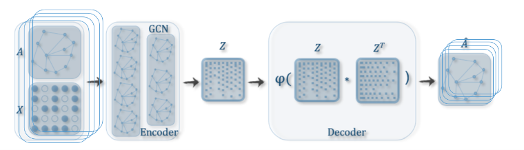

# pharmocogenomics_part2_GCN  
## GCN+VAE (Graph Convolutional Network & AutoEncoder)   

## Steps:  

    1. data_preprocess:
      generate sub graph for each target protein
        order all neighbors by distance through shortest path algorithm
        get fixed bumber K neighbors (K needs adjustment by experiment)
    2. Preprocess all sub graph to matrix format (A,X,…)
    3. Each sub-graph as an instance, feeding to GCN Auto-encoder network
    4. Collect target protein node latent vector from Z matrix
